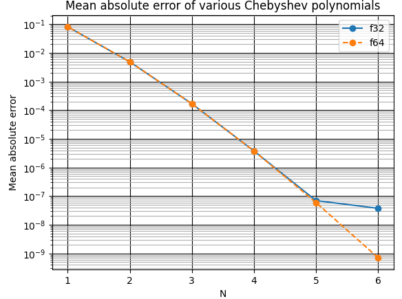

# Introduction
Derivation and benchmarking of Chebyshev polynomial approximation for sine.
- Decent low error approximation
- Easily vectorised for SIMD instructions
- Performance and accuracy can be increased/decreased by changing order of polynomial.

## Building
1. Configure cmake: ```cmake . -B build --preset windows-msvc-avx2 -DCMAKE_BUILD_TYPE=Release```
2. Compile programs: ```cmake --build build```

Refer to ```CMakePresets.json``` for all build presets for specific compilers.

## Programs
| Name | Description |
| --- | --- |
| benchmark_chebyshev_sine | Benchmark various implementations of sine against each other |
| derive_horner_polynomial | Use gradient descent to solve for best polynomial fit |

## Notebooks
1. Install python
2. Setup virtual environment: ```python -m venv venv```.
3. Activate environment: ```source ./venv/Scripts/activate``` or ```source ./venv/bin/activate```.
4. Install packages: ```pip install numpy matplotlib jupyter```.
5. Startup Jupyter notebook: ```jupyter-notebook .```

| Name | Description |
| --- | --- |
| chebyshev_derivation | Calculate Chebyshev polynomial coefficients using analytic solution (explained in .txt file) |
| plot_sine_error | Plot errors between sine implementations |

# Results
## Speed
- CPU: 7735HS
- Polynomial is 9th order with 6 calculated coefficients
- Using 32bit floats
- Samples = 8192
- Trials = 102400
- Data collected from ```src/benchmark_chebyshev_sine.cpp```.

```clang version 16.0.5 target: x86_64-pc-windows-msvc```
| Name | Time taken (ns) | Speed up | Mean absolute error |
| --- | --- | --- | --- |
| std::sine    | 2.91e+04 |  1.00 |          |
| cheby_scalar | 1.00e+03 | 29.07 | 3.38e-08 |
| cheby_sse    | 2.02e+03 | 14.37 | 3.38e-08 |
| cheby_avx    | 1.06e+03 | 27.50 | 3.38e-08 |
| mathfun_sse  | 5.31e+03 |  5.48 | 2.84e-08 |
| mathfun_avx  | 2.70e+03 | 10.77 | 2.84e-08 |
- cheby_scalar was vectorised by compiler.

```Microsoft (R) C/C++ Optimizing Compiler Version 19.38.33134 for x64```
| Name | Time taken (ns) | Speed up | Mean absolute error |
| --- | --- | --- | --- |
| std::sine    | 2.71e+03 | 1.00 |          |
| cheby_scalar | 7.52e+03 | 0.36 | 4.03e-08 |
| cheby_sse    | 1.93e+03 | 1.41 | 4.03e-08 |
| cheby_avx    | 1.10e+03 | 2.45 | 4.03e-08 |
| svml_sse     | 1.01e+04 | 0.27 | 5.06e-09 |
| svml_avx     | 2.57e+03 | 1.05 | 0.00e+00 |
| mathfun_sse  | 7.05e+03 | 0.38 | 1.24e-08 |
| mathfun_avx  | 3.78e+03 | 0.72 | 1.24e-08 |
- cheby_scalar was not vectorised by compiler (Unrolling Horner multiplication loop manually allows for vectorisation).
- std::sine performs like svml_avx since MSVC uses Intel's SVML library (The calculated values are also identical).

```gcc version 11.4.0 target: aarch64-linux-gnu```
|         Name | Time (ns) | Speed up | Mean absolute error |
| ------------ | --------- | -------- | -------- |
|          std |  9.03e+05 |          |          |
| cheby_scalar |  3.88e+05 |     2.33 | 3.37e-08 |
|   cheby_neon |  3.74e+05 |     2.42 | 3.38e-08 |
- Run using ```qemu-aarch64``` (Refer to ./toolchains/README.md).
- Emulating aarch64 using same 7735HS processor.

## Accuracy
- Taken from ```./notebooks/plot_sine_error.ipynb```.


- f32 has a higher minimum error floor compared to f64.


- If you are using sine approximation for digital signal processing (DSP), the size of the harmonics can give you an estimate of total harmonic distortion (THD).
- You can reduce the order of the polynomial and still maintain good THD.
